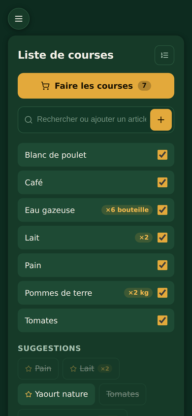
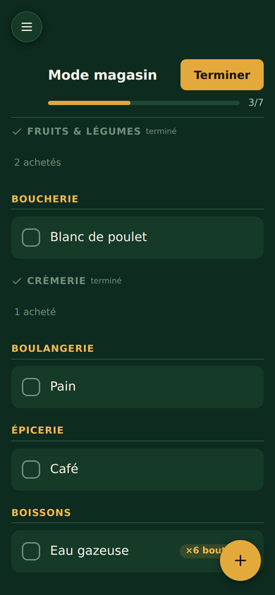
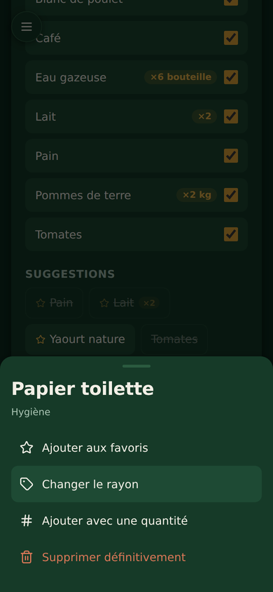
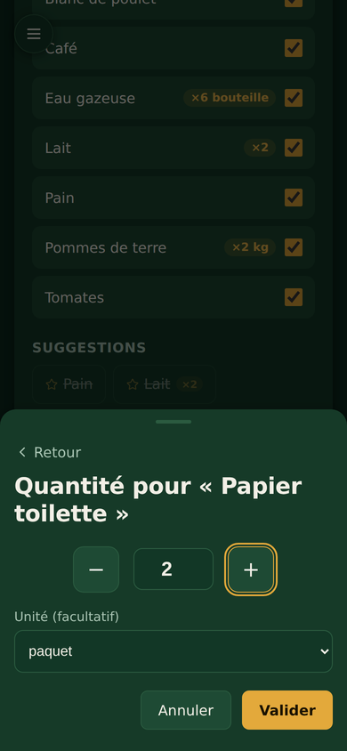
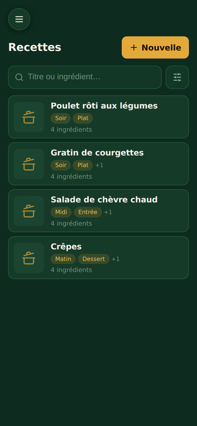
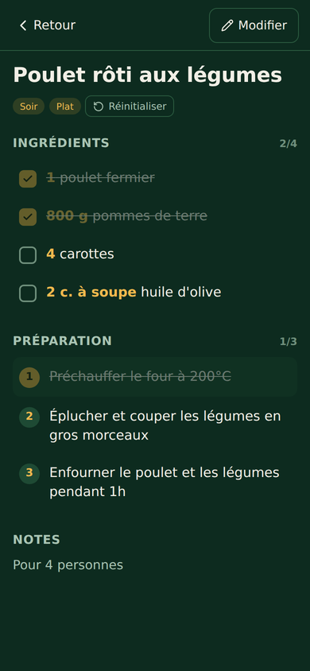
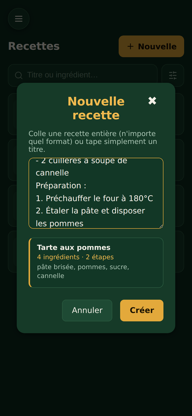
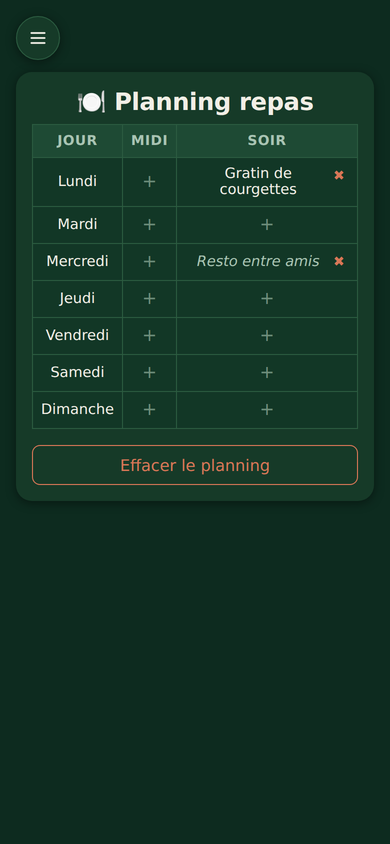
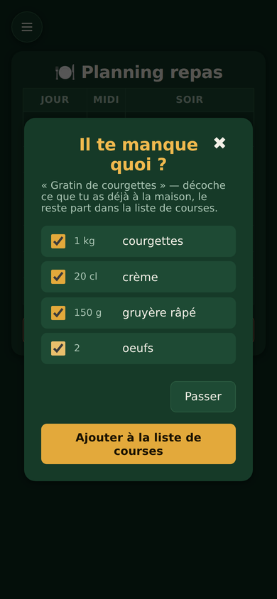

<div align="center">
  
  <h1>Liste Courses</h1>
  <p>
    <b>Liste de courses familiale, planning des repas et carnet de recettes.</b><br>
    Application web installable (PWA), pensée pour être utilisée d'une main,<br>
    un chariot dans l'autre.
  </p>
</div>

---

## Aperçu

<table>
  <tr>
    <td align="center" width="25%"><br><sub><b>Liste de courses</b></sub></td>
    <td align="center" width="25%"><br><sub><b>Mode magasin</b></sub></td>
    <td align="center" width="25%"><br><sub><b>Actions par appui long</b></sub></td>
    <td align="center" width="25%"><br><sub><b>Quantité et unité</b></sub></td>
  </tr>
  <tr>
    <td align="center"><br><sub><b>Recettes</b></sub></td>
    <td align="center"><br><sub><b>Fiche et mode cuisine</b></sub></td>
    <td align="center"><br><sub><b>Import par collage</b></sub></td>
    <td align="center"><br><sub><b>Planning des repas</b></sub></td>
  </tr>
</table>

---

## Ce que fait l'application

### Liste de courses

L'écran principal, celui qu'on ouvre le jour des courses.

- **Une seule barre** pour chercher dans les articles connus et en ajouter de nouveaux : suggestions dès la frappe, insensibles à la casse et aux accents
- **Casse harmonisée** : `TOMATE`, `tomate` ou `ToMaTe` deviennent tous `Tomate`
- **Quasi-doublons détectés** : taper « Tomate » quand « Tomates » existe déjà propose de réutiliser l'existant plutôt que de créer un doublon
- **Suggestions** : tous les articles jamais saisis, favoris en tête puis les plus utilisés. Un article déjà sur la liste reste visible, grisé et barré — un tap le retire, ce qui rattrape les fausses manips
- **Appui long** sur un article : favori, rayon, quantité, suppression définitive

<table>
  <tr>
    <td width="50%"></td>
    <td><b>Menu d'actions</b><br><br>Toutes les actions d'un article au même endroit, sans mode « Modifier » à activer au préalable. L'écran reste épuré tant qu'on n'appuie pas longuement.</td>
  </tr>
</table>

### Mode magasin

<table>
  <tr>
    <td><b>Pensé pour l'allée du supermarché</b><br><br>
    • Articles regroupés <b>par rayon</b>, dans l'ordre où vous les croisez (réglable une fois pour toutes)<br>
    • Un article coché descend dans un repli « achetés » de son rayon, il ne disparaît pas<br>
    • Un rayon terminé se replie avec une coche : plus besoin d'y passer<br>
    • Compteur et barre de progression en haut<br>
    • Bouton flottant pour l'article oublié en cours de route<br>
    • À la sortie, les articles achetés quittent la liste mais restent dans l'historique
    </td>
    <td width="45%"></td>
  </tr>
</table>

**Rayons reconnus automatiquement** à partir du nom : Fruits & Légumes, Boucherie, Poissonnerie, Crèmerie, Boulangerie, Épicerie, Surgelés, Boissons, Hygiène, Entretien, Autre. La détection privilégie le mot-clé le plus long, pour que « lait de coco » aille en Épicerie et non en Crèmerie. Un rayon mal deviné se corrige d'un appui long.

### Recettes

<table>
  <tr>
    <td width="45%"></td>
    <td><b>Collez n'importe quel format</b><br><br>
    Le parseur accepte les puces (<code>-</code>, <code>•</code>, <code>*</code>), la numérotation, les sections nommées ou absentes, les quantités avant ou après le nom, les unités en toutes lettres et les fractions.<br><br>
    Un aperçu affiche ce qui a été compris <b>avant</b> d'enregistrer.
    </td>
  </tr>
</table>

- **Recherche par titre et par ingrédient** : chercher « miel » remonte les recettes qui en contiennent
- **Tags fixes** classés par famille : Moment (Matin, Midi, Soir, Apéro), Type (Entrée, Plat, Accompagnement, Sauce, Dessert, Gâteau), Contrainte (Rapide, Végé). Seuls les tags réellement utilisés sont proposés au filtrage
- **Édition en texte libre** : ingrédients et étapes se saisissent dans une zone de texte, une ligne par élément
- **Mode cuisine** : chaque ingrédient et chaque étape se coche d'un tap, avec compteur et remise à zéro. L'écran reste allumé tant que la fiche est ouverte
- La fiche s'ouvre en plein écran et se ferme de trois façons : bouton **Retour**, touche **Échap**, ou le **bouton retour du téléphone**

### Planning des repas

<table>
  <tr>
    <td><b>Du planning à la liste de courses</b><br><br>
    On clique sur un créneau de la semaine, on cherche une recette, et l'application demande aussitôt ce qui manque à la maison. Les ingrédients cochés partent dans la liste de courses avec leur quantité.<br><br>
    Pas de fiche pour ce repas ? Taper le nom suffit : il est enregistré comme <b>repas libre</b>, sans passer par l'étape des ingrédients.
    </td>
    <td width="45%"></td>
  </tr>
</table>

Les quantités de recette sont converties vers un format utile aux achats : `800 g de pommes de terre` devient `×800 g`, `3 oignons` devient `×3`, et `2 c. à soupe de moutarde` n'ajoute aucune quantité — on achète un pot de moutarde, pas deux cuillères.

---

## Installation

```bash
npm install
cp .env.example .env      # puis renseigner les clés Firebase
npm run dev
```

L'application est ensuite disponible sur `http://localhost:5173`.

### Scripts

| Commande | Effet |
| --- | --- |
| `npm run dev` | Serveur de développement, accessible sur le réseau local |
| `npm run build` | Build de production dans `dist/` |
| `npm run preview` | Sert le build de production en local |
| `npm run lint` | Analyse ESLint |

---

## Configuration Firebase

### Variables d'environnement

À placer dans un fichier `.env` à la racine (jamais versionné) :

```env
VITE_FIREBASE_API_KEY=
VITE_FIREBASE_AUTH_DOMAIN=
VITE_FIREBASE_PROJECT_ID=
VITE_FIREBASE_STORAGE_BUCKET=      # inutilisé : voir « Photos sans Firebase Storage »
VITE_FIREBASE_MESSAGING_SENDER_ID=
VITE_FIREBASE_APP_ID=
```

L'authentification se fait en **anonyme** : aucun compte à créer, tous les appareils de la famille partagent les mêmes données via un identifiant commun (`sharedFamily`).

### Structure des données (Firestore)

```
families/sharedFamily/
├── shoppingItems/{id}        Articles de la liste de courses
│   ├── name        string    Nom affiché, casse harmonisée
│   ├── checked     bool      Présent sur la liste active
│   ├── bought      bool      Acheté pendant la sortie en cours
│   ├── favored     bool      Épinglé en tête des suggestions
│   ├── rayon       string    Identifiant de rayon (ex. "cremerie")
│   ├── quantity    number    Remise à zéro à la sortie de la liste
│   ├── unit        string    Mémorisée d'une fois sur l'autre
│   ├── useCount    number    Nombre d'ajouts, sert au tri
│   └── createdAt   number
│
├── recipes/{id}              Fiches recettes
│   ├── title       string
│   ├── ingredients array     [{ quantity: "200 g", name: "farine" }]
│   ├── steps       array     ["Préchauffer le four", …]
│   ├── tags        array     ["Soir", "Plat"]
│   ├── notes       string
│   └── thumbUrl    string    Miniature (data URL, ~5 Ko) pour les cartes
│
├── recipePhotos/{idRecette}  Photo complète, document séparé
│   └── dataUrl     string    Image en base64, chargée à l'ouverture d'une fiche
│
├── mealPlans/{yyyy-semaine}  Planning d'une semaine
│   └── {Jour}.{midi|soir}    { recipeId, title } ou { title, free: true }
│
└── settings/shopping
    └── rayonOrder  array     Ordre des rayons en magasin
```

---

## Structure du projet

```
src/
├── App.jsx                 Navigation entre les trois écrans
├── ShoppingList.jsx        Écran principal : liste de courses
├── Recipes.jsx             Liste et création des recettes
├── MealPlan.jsx            Planning de la semaine
├── firebase.js             Initialisation Firebase + cache hors-ligne
│
├── components/
│   ├── Sidebar.jsx                 Bouton burger flottant + tiroir
│   ├── AddBar.jsx                  Barre recherche + ajout
│   ├── ItemActionMenu.jsx          Menu d'appui long (article)
│   ├── StoreMode.jsx               Mode magasin
│   ├── RayonOrderEditor.jsx        Ordre des rayons
│   ├── RecipeCard.jsx              Fiche en liste
│   ├── RecipeSheet.jsx             Fiche plein écran + mode cuisine
│   ├── MealRecipePicker.jsx        Choix d'une recette ou repas libre
│   └── MissingIngredientsModal.jsx Ingrédients manquants
│
├── hooks/
│   ├── useLongPress.js     Distingue tap court et appui long
│   ├── useWakeLock.js      Empêche l'écran de s'éteindre
│   └── useDismissable.js   Fermeture par Échap et bouton retour
│
└── utils/
    ├── normalize.js        Casse, accents, détection de doublons
    ├── rayons.js           Rayons et détection automatique
    ├── units.js            Unités et conversion pour les achats
    ├── tags.js             Tags de recettes
    └── parseRecipe.js      Analyse d'une recette collée
```

---

## Notes techniques

**PWA** — Installable sur l'écran d'accueil, avec service worker (`vite-plugin-pwa`) et mise à jour automatique. Les images de recettes sont mises en cache 30 jours. La persistance IndexedDB de Firestore permet de consulter la liste sans connexion.

**Thème** — Toutes les couleurs sont des variables CSS définies dans `src/index.css`. Changer la palette de l'application entière se fait en modifiant ce seul fichier.

**Ergonomie mobile** — Toutes les cibles tactiles font au minimum 44 px. Les appuis longs passent par les *pointer events*, ce qui couvre souris et tactile sans double déclenchement.

**Photos sans Firebase Storage** — Depuis septembre 2024, provisionner un bucket Cloud Storage impose le plan payant Blaze. Les photos de recettes sont donc redimensionnées à 1200 px, compressées, et enregistrées **dans Firestore** sous forme de data URL. La miniature vit dans le document de la recette (pour les cartes), la photo complète dans un document séparé chargé à la demande — sinon ouvrir la liste téléchargerait toutes les photos. Un plafond de 700 Ko, avec repli automatique sur une qualité inférieure, garantit de rester sous la limite de 1 Mio par document Firestore. Effet de bord agréable : les photos sont consultables hors-ligne, ce qu'une URL Storage ne permet pas.

**Extension possible : import de recettes par IA** — Toute l'analyse d'un texte collé passe par la seule fonction `parseRecipeText()` de `src/utils/parseRecipe.js`. Pour déléguer la compréhension à une IA, il suffit d'y appeler une fonction serverless (dossier `/api` sur Vercel, clé API en variable d'environnement) renvoyant le même objet : aucun composant n'a à changer.

**Dépendance inutilisée** — `tailwindcss`, `postcss` et `autoprefixer` figurent dans les `devDependencies` mais ne sont utilisés nulle part (aucun fichier de configuration, aucune classe utilitaire). Ils peuvent être retirés sans risque.

---

## Déploiement

Le projet est prévu pour **Vercel** : build `npm run build`, dossier de sortie `dist/`. Les variables `VITE_FIREBASE_*` sont à déclarer dans les réglages du projet Vercel.
